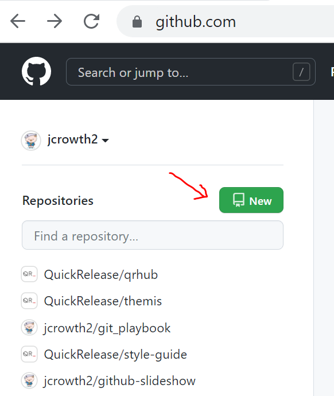
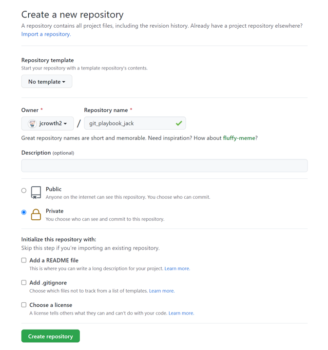
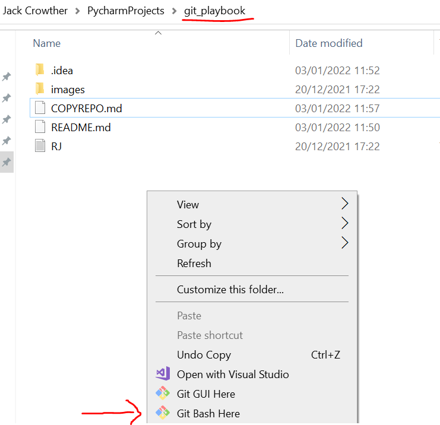

## Follow instructions to Copy this Repo
#### Any issues please feel free to get in touch with one of the SP team

1. Go to your GitHub account
2. Create a new Remote Repo 
   
3. Create a Remote Repo with the following settings (name it however you see fit!) 
   

The Repo we cloned in Bash is currently locally stored on your machine, we're going
to copy it and update this new Remote Repo with its contents. 

(Do not worry too much about understanding these commands yet, this will come later)

4. Go to git bash and enter `git remote rename origin upstream` (Make sure you are in the
   correct directory on Bash before you do this. Easiest way is to right click in the
   high level project folder and select "Git Bash here". If you do not know how to use `cd`
   to move into directories from a console, it may also be worth googling and learning
   how to do this.)
   
5. On GitHub your new repository will have a URL, find and copy it.
6. Enter `git remote add origin <URL_TO_GITHUB_REPO>` in Bash.
7. Enter `git push origin master` in Bash. 

If you now go to GitHub, your Repo should look exactly like the original.

Note: This is NOT a normal procedure. Usually cloning the Repo is all you would do
and all Users would share the same remote. What we have done here is copy the Remote.
This is done purely so you have your own remote repo you can pull and push to without 
interfering with other people working on the same playbook at the same time. 
